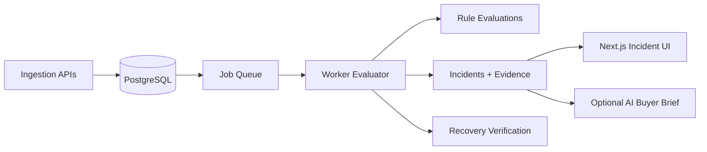

# CatchDrift

CatchDrift is a deployment-aware campaign protection system for media-buying teams. It detects tracking-integrity failures while paid spend is still active, preserves evidence, estimates exposure, and verifies recovery.

## Live Submission

- Live URL: https://catchdrift.media/
- Railway URL: https://catchdrift-web-production.up.railway.app
- Repository: https://github.com/dev-dominick/catchdrift

## What CatchDrift Does

CatchDrift continuously evaluates campaign telemetry and deployment events, then opens a deterministic incident when all required conditions persist:

- spend remains materially active;
- click-to-session loss degrades above threshold;
- attribution declines above threshold;
- degradation persists for required intervals;
- required sources are fresh (stale-source suppression prevents unsafe decisions).

When triggered, CatchDrift records immutable incident evidence:

- baseline metrics;
- threshold requirements;
- degraded-window signals;
- deterministic deployment correlation score;
- deterministic exposure range.

It then tracks lifecycle transitions from detected to recovered/resolved and verifies recovery using explicit metric criteria.

## Why This Problem

Paid campaigns can continue spending while attribution quality silently degrades after operational changes. Teams often see symptoms in dashboards but do not quickly connect:

- financial risk;
- probable operational change;
- safe investigation sequence.

CatchDrift focuses on this specific failure mode because one high-spend incident detected earlier can justify the system.

## Why This Helps Media Buying Economics

Example from deterministic replay profile:

- Estimated exposure rate: $230-$310/hour
- Manual discovery assumption: 90 minutes later
- Potential additional exposure surfaced earlier: $344-$465

This is not confirmed money saved. It is estimated exposure surfaced while failure could otherwise remain unnoticed.

## AI Boundary (Deliberately Safe)

CatchDrift keeps all financial and incident decisions deterministic.

AI is optional and limited to an investigation brief generated from persisted structured evidence. AI may summarize and prioritize inspection steps, but AI may not:

- create incidents;
- change severity or confidence;
- alter exposure values;
- claim causation;
- control campaign spend.

If model configuration is unavailable or output is invalid, CatchDrift falls back to deterministic guidance.

## Capability Matrix

| Capability | Implemented | Notes |
|---|---|---|
| Deterministic detection (`tracking_integrity_failure@1`) | Yes | Persistence gating + spend gating + freshness checks |
| Deployment correlation | Yes | Evidence-backed score, explicitly non-causal |
| Exposure calculation | Yes | Deterministic exposure model with persisted breakdown |
| Incident lifecycle | Yes | detected -> acknowledged -> investigating -> recovered/resolved |
| Recovery verification | Yes | Deterministic multi-interval recovery criteria |
| Stale-source suppression | Yes | Rule suppression with reasons |
| Grounded AI buyer brief | Yes (optional) | Schema-validated output + deterministic fallback |
| Provider OAuth connectors | No | Simulated replay inputs for challenge demo |
| Automatic campaign pausing | No | Intentionally excluded for operational safety |

## Architecture

Runtime model:

- Web: Next.js App Router pages + APIs
- Worker: queued campaign evaluation + lifecycle updates
- DB: PostgreSQL via Drizzle schema/migrations

## Security Boundary

- Ingestion endpoints require bearer token (`INGESTION_TOKEN`).
- Incident logic reads persisted aggregates only (no lead PII required).
- Worker error persistence is redacted.
- Secrets are environment-scoped.
- AI payloads are structured evidence only; no key or secret logging.
- No automatic remediation actions in MVP.

## Real vs Simulated

Real:

- ingestion API contracts;
- persistence, idempotency, revision handling;
- worker queue + retries;
- deterministic rule and exposure logic;
- deterministic correlation and recovery tracking;
- UI workflow across incident states.

Simulated:

- campaign telemetry source values for replay;
- deployment event feed input for demo;
- external ad-platform connectors.

## Local Setup

1. Install dependencies: `pnpm install`
2. Start PostgreSQL: `docker compose up -d`
3. Copy env: `cp .env.example .env`
4. Run migration: `pnpm db:migrate`
5. Start worker + web:
   - `pnpm start:worker`
   - `pnpm dev`

## Environment Variables

Required:

- `DATABASE_URL`
- `INGESTION_TOKEN`
- `WORKER_ID`
- `NODE_ENV`
- `APP_BASE_URL`

Optional (AI brief):

- `OPENAI_API_KEY`
- `OPENAI_MODEL` (default: `gpt-4.1-mini`)

## Demo Instructions (Reset to Recovery)

1. Open homepage.
2. Click **Run the 90-second protection demo**.
3. Watch automatic transition from healthy baseline to detected incident.
4. Review money-first incident summary, baseline comparison, trigger explanation, deployment correlation, and recovery evidence.
5. Optionally generate an investigation brief.
  - label is **AI-generated investigation brief** only when model output succeeds;
  - otherwise label is **Deterministic investigation brief** using persisted evidence.
6. Click **Replay Demo** from incident page to rerun and verify recovered state in exception queue.

CLI equivalent:

- `pnpm demo:reset`
- `pnpm demo:replay`

## Test Commands

- Typecheck: `pnpm typecheck`
- Unit: `pnpm test:unit`
- Integration: `pnpm test:integration`
- E2E: `pnpm test:e2e`
- Full suite: `pnpm test`

## Contest Questions (Direct Answers)

### What does this tool do?

CatchDrift detects active-spend tracking failures with deterministic rules, ties them to strongest correlated operational changes, estimates exposure, and verifies recovery while preserving immutable evidence.

### Why this problem?

This is a high-cost failure mode in paid media: spend continues while tracking quality deteriorates. Detection delay creates avoidable exposure and poor optimization decisions. A lean team needs prioritized, evidence-backed exceptions, not another broad dashboard.

### What would I build next as full-time engineer?

1. Buyer discovery sessions with It's Today Media operators.
2. Read-only integrations for actual spend, attribution, revenue, deployment, and landing-page systems.
3. Historical calibration for thresholds, confidence, and false-positive control.
4. Delivery into existing workflow channels (Slack/ticketing) with acknowledgement loops.
5. Second deterministic conversion-path integrity rule.
6. Pilot measurement of false positives, time-to-detect, time-to-acknowledge, and potential avoided exposure.
