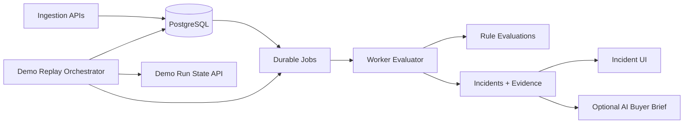

# CatchDrift

CatchDrift is a deployment-aware campaign protection system for media-buying teams. It detects tracking-integrity failures while paid spend is still active, preserves evidence, estimates exposure, and verifies recovery.

## Submission in 30 seconds

- Live URL: https://catchdrift.media/
- Railway URL: https://catchdrift-web-production.up.railway.app
- Repository: https://github.com/dev-dominick/catchdrift
- Demo path: homepage -> run live replay -> incident appears active -> recovery verified on incident page

## What it does

CatchDrift continuously evaluates campaign telemetry and deployment events, then opens a deterministic incident when all required conditions persist:

- spend remains materially active;
- click-to-session loss degrades above threshold;
- attribution declines above threshold;
- degradation persists for required intervals;
- required sources are fresh (stale-source suppression prevents unsafe decisions).

When triggered, CatchDrift records immutable incident evidence:

- baseline metrics;
- threshold requirements;
- degraded-window signals;
- deterministic deployment correlation score;
- deterministic exposure range.

It then tracks lifecycle transitions from detected to recovered/resolved and verifies recovery using explicit metric criteria.

## Why this problem

Paid campaigns can continue spending while attribution quality silently degrades after operational changes. Teams often see symptoms in dashboards but do not quickly connect:

- financial risk;
- probable operational change;
- safe investigation sequence.

CatchDrift focuses on this specific failure mode because one high-spend incident detected earlier can justify the system.

The challenge required independent problem selection. I selected this hypothesis from It's Today Media's described media-buying workflow. My first full-time step would be validating its frequency, cost, current response process, and false-positive tolerance with media buyers before expanding implementation.

## What I would build next

1. Operator discovery interviews to calibrate detection thresholds and alert fatigue tolerance.
2. Connector ingestion from real ad, attribution, and deployment systems.
3. Channel delivery into Slack/ticketing with acknowledgement loops.
4. Additional deterministic rules for conversion-path integrity variants.
5. Outcome instrumentation for time-to-detect, time-to-acknowledge, and estimated exposure surfaced.

## Run the live demo

1. Open `/`.
2. Click `Run the 25-second incident replay`.
3. Observe active incident state before recovery.
4. Keep incident detail open and watch status update to recovered.

CLI equivalent:

- `pnpm demo:reset`
- `pnpm demo:replay`

## Why the buyer cares

Example from deterministic replay profile:

- Estimated exposure rate: $230-$310/hour
- Manual discovery assumption: 90 minutes later
- Potential additional exposure surfaced earlier: $344-$465

This is not confirmed money saved. It is estimated exposure surfaced while failure could otherwise remain unnoticed.

## Real versus simulated

Real:

- ingestion API contracts;
- persistence, idempotency, revision handling;
- worker queue + retries;
- deterministic rule and exposure logic;
- deterministic correlation and recovery tracking;
- asynchronous replay run-state contracts (202/200/409/429);
- UI workflow across incident states.

Simulated:

- campaign telemetry source values for replay;
- deployment event feed input for demo;
- external ad-platform connectors.

## Architecture

Runtime details:

- Normal ingestion uses durable queued jobs and a worker.
- Contest demo replay processes only its isolated demo jobs inline without relying on a separately scheduled worker.
- Both paths use the same persisted evaluation and incident logic.

## Safety boundaries

CatchDrift keeps all financial and incident decisions deterministic.

AI is optional and limited to an investigation brief generated from persisted structured evidence. AI may summarize and prioritize inspection steps, but AI may not:

- create incidents;
- change severity or confidence;
- alter exposure values;
- claim causation;
- control campaign spend.

If model configuration is unavailable or output is invalid, CatchDrift falls back to deterministic guidance.

## Local Setup

1. Install dependencies: `pnpm install`
2. Start PostgreSQL: `docker compose up -d`
3. Copy env: `cp .env.example .env`
4. Run migration: `pnpm db:migrate`
5. Start worker + web:
   - `pnpm start:worker`
   - `pnpm dev`

## Environment Variables

Required:

- `DATABASE_URL`
- `INGESTION_TOKEN`
- `WORKER_ID`
- `NODE_ENV`
- `APP_BASE_URL`

Optional (AI brief):

- `OPENAI_API_KEY`
- `OPENAI_MODEL` (default: `gpt-4.1-mini`)

## Verification

- Typecheck: `pnpm typecheck`
- Lint: `pnpm lint`
- Unit: `pnpm test:unit`
- Integration: `pnpm test:integration`
- Combined unit + integration: `pnpm test`
- E2E: `pnpm test:e2e`
- Full automated suite: `pnpm test:all`
- Contest verification gate: `pnpm verify`

`pnpm verify` runs: typecheck, lint, unit tests, integration tests, production build, and E2E.

## Detailed technical notes

- Rule identity: `tracking_integrity_failure@1`
- Required stale-source suppression is derived from current time and source delay expectations, not trusted from persisted `freshness_state`.
- Incident correlation is strongest-evidence correlation, not root-cause proof.
- Exposure is deterministic and labeled as estimate.
- Replay and reset endpoints enforce contention and throttle semantics:
  - `202` replay accepted;
  - `200` status polling responses;
  - `409` contention conflicts;
  - `429` cooldown/rate limits;
  - safe `5xx` operational failures with public reference IDs.
